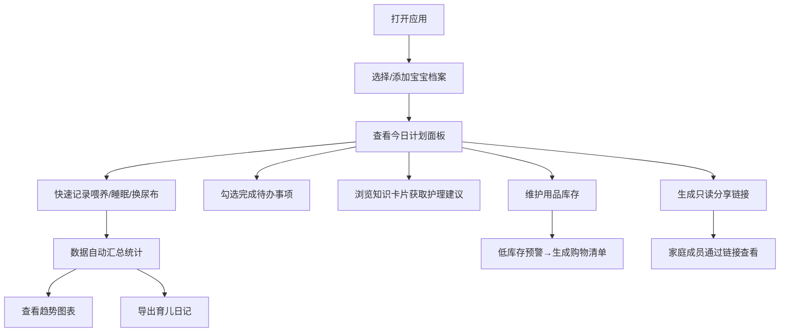

## 1. 产品概述

宝妈育儿管理助手是一款轻量级纯前端 Web 应用，为新手妈妈提供一站式每日育儿安排管理工具。通过记录喂养、睡眠、疫苗、用品库存等关键信息，配合知识卡片、数据趋势分析和家庭共享功能，帮助新手妈妈科学高效地照顾宝宝。

- 目标用户：0-3 岁宝宝的新手妈妈及主要照护人
- 核心价值：简化育儿记录流程、提供科学护理指导、促进家庭成员协同照护

## 2. 核心功能

### 2.1 用户角色
| 角色 | 注册方式 | 核心权限 |
|------|----------|----------|
| 主要照护人 | 本地存储无需注册 | 完整功能权限：记录管理、宝宝档案管理、数据导出、家庭共享 |
| 家庭成员（只读） | 通过共享链接访问 | 查看所有记录、知识卡片，无编辑权限 |

### 2.2 功能模块
1. **今日计划**：待办事项勾选、今日事件一览、快速记录入口
2. **喂养记录**：喂奶/辅食/换尿布记录，含时间、类型、数量、备注
3. **睡眠记录**：睡眠时段记录、时长统计、每日睡眠汇总
4. **用品清单**：奶粉/纸尿裤库存维护、低库存预警、购物清单生成
5. **知识卡片**：按月龄展示护理提示、卡片收藏、分类浏览
6. **家庭共享**：生成只读分享链接、家庭成员查看
7. **数据汇总**：身高体重记录、生长趋势图、日记导出、喂养/睡眠统计

### 2.3 页面详情
| 页面名称 | 模块名称 | 功能描述 |
|----------|----------|----------|
| 主页面 | 顶部导航栏 | 宝宝档案切换、夜间模式切换、当前日期显示 |
| 主页面 | 今日计划 | 待办勾选、快速添加待办、今日事件时间轴 |
| 主页面 | 喂养记录 | 添加喂奶/辅食/换尿布、记录列表、今日统计 |
| 主页面 | 睡眠记录 | 开始/结束睡眠计时、睡眠段列表、每日时长统计 |
| 主页面 | 用品清单 | 库存增减、低库存预警、一键生成购物清单 |
| 主页面 | 知识卡片 | 月龄筛选、卡片翻页浏览、收藏功能 |
| 主页面 | 家庭共享 | 生成分享码/链接、复制链接、查看分享状态 |
| 主页面 | 数据汇总 | 身高体重录入、趋势折线图、喂养/睡眠统计、导出日记 |
| 主页面 | 疫苗提醒 | 设置疫苗/体检计划、到期提醒、完成标记 |

## 3. 核心流程

## 4. 用户界面设计

### 4.1 设计风格
- **主色调**：柔和粉色系 `#FFB6C1`（主色）+ 奶油白 `#FFFAF0`（背景）+ 薄荷绿 `#98FB98`（辅助色）
- **夜间模式**：深灰蓝 `#1A1A2E`（背景）+ 暖白 `#E8E8E8`（文字）
- **按钮风格**：圆润胶囊形，12px 圆角，柔和渐变阴影，hover 微放大效果
- **字体**：中文使用「Noto Sans SC」，标题使用「ZCOOL KuaiLe」可爱风格字体
- **布局风格**：卡片式宫格布局，圆角 16px，柔和阴影，留白充足
- **图标风格**：Lucide 图标库 + 柔和 Emoji 点缀，配色与主题一致

### 4.2 页面设计概览
| 模块 | UI 元素 | 说明 |
|------|---------|------|
| 顶部导航 | 宝宝头像下拉、月亮/太阳图标、日期标签 | 固定在顶部，毛玻璃背景效果 |
| 今日计划 | 圆形复选框、时间轴、浮动添加按钮 | 时间轴式展示今日事件 |
| 喂养记录 | 分类图标（奶瓶/辅食/尿布）、数量输入、备注 | 卡片列表，按时间倒序 |
| 睡眠记录 | 计时器、睡眠条形图、时长统计 | 可视化睡眠段分布 |
| 用品清单 | 库存进度条、加减按钮、预警色标 | 低库存变红，进度条可视化 |
| 知识卡片 | 翻页动画、收藏心形、月龄筛选条 | 卡片堆叠翻页效果 |
| 家庭共享 | 二维码占位、链接复制按钮 | 简约分享面板 |
| 数据汇总 | 折线图、统计卡片、导出按钮 | 图表区域阴影渐变背景 |

### 4.3 响应式
- 桌面端：两列或三列宫格布局，卡片并排展示
- 平板端：两列自适应布局
- 移动端：单列堆叠，底部 Tab 导航替代顶部导航
- 所有交互元素支持触控，最小点击区域 44×44px
