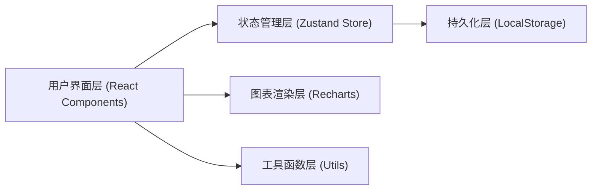
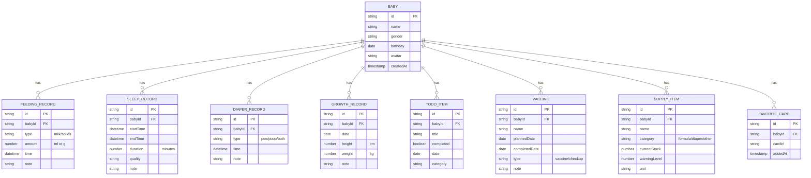

## 1. 架构设计



## 2. 技术描述
- **前端框架**：React@18 + TypeScript
- **构建工具**：Vite@5
- **样式方案**：TailwindCSS@3
- **状态管理**：Zustand + persist 中间件（LocalStorage 持久化）
- **图表库**：Recharts（轻量级 React 图表库）
- **图标库**：lucide-react
- **日期处理**：date-fns
- **后端**：无（纯前端应用，数据全部本地存储）
- **数据存储**：浏览器 LocalStorage（JSON 序列化）

## 3. 路由定义
| 路由 | 用途 |
|------|------|
| / | 主页面，包含所有七大功能模块（单页应用，模块间通过滚动/折叠切换） |

本项目为单页应用（SPA），采用 Tab 切换 + 滚动组合方式展示各模块，不设置多页面路由。

## 4. 数据模型

### 4.1 数据模型定义



### 4.2 Store 模块划分
- `useBabyStore`：宝宝档案管理（增删改查、当前宝宝切换）
- `useFeedingStore`：喂养/换尿布记录 CRUD
- `useSleepStore`：睡眠记录 CRUD 与统计
- `useGrowthStore`：身高体重记录与趋势数据
- `useSupplyStore`：用品库存管理与购物清单生成
- `useTodoStore`：待办事项管理
- `useVaccineStore`：疫苗与体检提醒
- `useKnowledgeStore`：知识卡片数据与收藏
- `useUiStore`：夜间模式、当前激活 Tab、分享状态等 UI 状态

## 5. 项目目录结构

```
src/
├── components/
│   ├── layout/
│   │   ├── Header.tsx          # 顶部导航栏
│   │   └── ThemeProvider.tsx   # 主题/夜间模式提供者
│   ├── TodayPlan/              # 今日计划模块
│   ├── FeedingRecord/          # 喂养记录模块
│   ├── SleepRecord/            # 睡眠记录模块
│   ├── SupplyList/             # 用品清单模块
│   ├── KnowledgeCard/          # 知识卡片模块
│   ├── FamilyShare/            # 家庭共享模块
│   ├── DataSummary/            # 数据汇总模块
│   └── common/                 # 通用组件（按钮、卡片、模态框等）
├── store/
│   ├── baby.ts
│   ├── feeding.ts
│   ├── sleep.ts
│   ├── growth.ts
│   ├── supply.ts
│   ├── todo.ts
│   ├── vaccine.ts
│   ├── knowledge.ts
│   └── ui.ts
├── utils/
│   ├── date.ts                 # 日期处理工具
│   ├── storage.ts              # LocalStorage 封装
│   └── export.ts               # 导出工具（文本/CSV）
├── data/
│   └── knowledgeCards.ts       # 知识卡片 Mock 数据
├── types/
│   └── index.ts                # TypeScript 类型定义
├── pages/
│   └── Home.tsx                # 主页面
├── App.tsx
├── main.tsx
└── index.css
```
